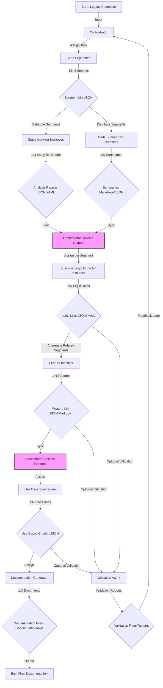

# Blueprint für ein Multi-Agenten-LLM-System zum Reverse Engineering von Legacy-Code

## 1. Einleitung

### 1.1. Zielsetzung des Anwenders

Das Kernziel besteht darin, ein System konfigurierter Large Language Models (LLMs) zu entwickeln, das in der Lage ist, Legacy-Quellcode mittels Reverse Engineering zu analysieren. Das Endresultat soll eine vollständige Extraktion aller im Code enthaltenen Features und Use Cases sein. Die Automatisierung dieses Prozesses, der traditionell manuell, zeitaufwendig und fehleranfällig ist[^1], verspricht erhebliche Effizienzgewinne und eine tiefere, konsistentere Analyse des Altsystems.

### 1.2. Kontext des GitHub Gist (SPARC)

Der bereitgestellte GitHub Gist 2 stellt das "SPARC Orchestration"-Framework (Specification, Pseudocode, Architecture, Refinement, Completion) vor. Dieses Framework bietet einen strukturierten Ansatz zur Bewältigung komplexer Aufgaben mithilfe von LLMs, indem es spezialisierte Rollen (oder "Modi") und einen definierten Workflow vorschlägt. Konzepte wie der SPARC Orchestrator, der Specification Writer, der Architect und die Nutzung von new_task zur Delegierung sowie attempt_completion als Abschlusssignal sind relevant. Dieser Bericht wird diese Konzepte aufgreifen, anpassen und spezifisch für die Herausforderungen des Reverse Engineerings von Legacy-Code erweitern.

### 1.3. Ziel und Umfang des Berichts

Dieser Bericht zielt darauf ab, einen detaillierten und umsetzbaren Plan für die Entwicklung des beschriebenen LLM-Systems zu liefern. Er beantwortet die spezifischen Fragen des Anwenders hinsichtlich der benötigten LLM-Rollen, des nahtlosen Workflow- und Übergabeprozesses, der Koordinationsstrategie, der geeigneten Dokumentationsformate für Features und Use Cases sowie der Mechanismen zur Fortschrittsverfolgung. Der Plan basiert auf aktuellen Forschungserkenntnissen zu Multi-Agenten-Systemen, LLM-Fähigkeiten im Bereich Code-Analyse und den inhärenten Herausforderungen bei der Arbeit mit LLMs.

### 1.4. Relevanz von LLMs für die Code-Analyse

Der Einsatz von LLMs für Aufgaben der Softwareentwicklung, insbesondere für Code-Analyse, Code-Zusammenfassung und sogar spezialisierte Bereiche wie Malware-Analyse und Reverse Engineering, nimmt stetig zu.1 LLMs zeigen bemerkenswerte Fähigkeiten im Verständnis von Code-Strukturen und der Generierung von natürlichsprachlichen Beschreibungen.7 Gleichzeitig erfordert die Komplexität des Reverse Engineerings und die Notwendigkeit präziser Ergebnisse strukturierte Ansätze und robuste Validierungsmechanismen, um die bekannten Schwächen von LLMs zu kompensieren.11

## 2. Definition spezialisierter LLM-Rollen für das Code Reverse Engineering

### 2.1. Begründung für einen Multi-Agenten-Ansatz

Die Aufgabe, ein komplexes Legacy-System vollständig zu analysieren und dessen Funktionalität zu extrahieren, übersteigt oft die Fähigkeiten eines einzelnen LLMs, insbesondere aufgrund von Kontextfensterbeschränkungen und der Tendenz zur Divergenz bei langwierigen, vielschichtigen Aufgaben.13 Ein Multi-Agenten-System bietet hier einen geeigneten Lösungsansatz.15 Durch die Aufteilung des Gesamtproblems in kleinere, spezialisierte Teilaufgaben, die von dedizierten Agenten bearbeitet werden, kann die Komplexität für jeden einzelnen Agenten reduziert werden. Dies erhöht die Effizienz, verbessert potenziell die Genauigkeit der Ergebnisse und ermöglicht eine parallele Verarbeitung.15 Dieser Ansatz steht im Einklang mit dem im Gist 2 vorgestellten Konzept der spezialisierten Modi. Frameworks wie AutoGen sind explizit für die Orchestrierung solcher kollaborativen Multi-Agenten-Systeme konzipiert.16

Die Aufteilung der Arbeit auf spezialisierte Agenten wirkt den bekannten Limitierungen von LLMs entgegen. Da LLMs Schwierigkeiten mit sehr großen Kontexten haben 14 und bei komplexen, mehrstufigen Aufgaben divergieren können 13, begrenzt die Modularität des Multi-Agenten-Ansatzes den Umfang und die Komplexität, die jeder einzelne Agent bewältigen muss. Der Code Segmenter reduziert die Kontextgröße für nachfolgende Agenten. Der Static Analyzer konzentriert sich auf die Struktur, der Summarizer auf die Erklärung, der Logic Extractor auf die Semantik usw. Jeder Agent operiert somit innerhalb seines optimalen Fähigkeitsbereichs, was die Wahrscheinlichkeit von Halluzinationen 18 oder Divergenz im Vergleich zu einem monolithischen Ansatz verringert. Dies erhöht die Erfolgswahrscheinlichkeit, erfordert jedoch eine sorgfältige Koordination und Orchestrierung der Agenteninteraktionen.

### 2.2. Vorgeschlagene Rollen (basierend auf Gist[^2]und Forschung)

Folgende spezialisierte LLM-Rollen werden für das Reverse Engineering von Legacy-Code vorgeschlagen:

* **Code Segmenter:**
  * *Verantwortlichkeit:* Nimmt die Legacy-Codebasis entgegen und teilt sie in überschaubare, logisch zusammenhängende Einheiten auf (z. B. Dateien, Klassen, Funktionen, Module). Berücksichtigt dabei die Code-Komplexität und potenzielle Größenbeschränkungen (wie die 500-Zeilen-Empfehlung in 2).
  * *Eingabe:* Legacy-Quellcode-Repository/-Dateien.
  * *Ausgabe:* Liste von Code-Segmenten mit Metadaten (Dateipfad, Start-/Endzeilen, ggf. grobe Abhängigkeiten). Format: JSON-Liste.
  * *Fähigkeiten:* Code-Parsing, Erkennung struktureller Grenzen, grundlegende Abhängigkeitsanalyse.
* **Static Analyzer:**
  * *Verantwortlichkeit:* Führt statische Analysen für einzelne Code-Segmente durch. Extrahiert Informationen wie Funktionssignaturen, Variablentypen (soweit möglich), Abhängigkeiten (interne/externe Aufrufe), Kontrollflussgraphen (CFGs) und identifiziert potenziell grundlegende Code-Muster oder Anti-Muster, eventuell unter Nutzung von Techniken ähnlich AST Grep.19 Nutzt LLM-Fähigkeiten zum Verständnis von Code-Strukturen.3
  * *Eingabe:* Code-Segment, potenziell eine abstrakte Syntaxbaum (AST)-Repräsentation.19
  * *Ausgabe:* Strukturierter Analysebericht (JSON/YAML) mit Details zu Funktionen, Variablen, Aufrufen, Abhängigkeiten, potenziellen Problemen, CFG-Beschreibung.
  * *Fähigkeiten:* Code-Parsing, AST-Traversierung/-Analyse 19, Mustererkennung, Verständnis der Sprachsyntax.
* **Code Summarizer & Explainer:**
  * *Verantwortlichkeit:* Generiert natürlichsprachliche Zusammenfassungen und Erklärungen für Code-Segmente, die sich darauf konzentrieren, *was* der Code auf funktionaler Ebene tut. Nutzt die starken Fähigkeiten von LLMs zur Code-Zusammenfassung.5 Erklärt den Zweck von Funktionen/Klassen basierend auf den Ergebnissen der statischen Analyse und dem Code-Inhalt selbst. Adressiert den Aspekt der Code-Erklärung, der in 6 hervorgehoben wird.
  * *Eingabe:* Code-Segment, Statischer Analysebericht.
  * *Ausgabe:* Natürlichsprachliche Zusammenfassung (Markdown/Text), strukturierte Erklärung (JSON, die Erklärungen mit Codezeilen/-blöcken verknüpft).
  * *Fähigkeiten:* Code-Verständnis, Generierung natürlicher Sprache, Verknüpfung von Code-Struktur und Funktion.
* **Business Logic Extractor:**
  * *Verantwortlichkeit:* Analysiert Code-Segmente und deren Zusammenfassungen, um Kern-Geschäftsregeln, Algorithmen und Logik zu identifizieren und zu extrahieren. Unterscheidet diese von Boilerplate-Code oder Infrastruktur-Code. Dies ist ein kritischer Schritt, der tiefes Code-Verständnis erfordert.22 Beinhaltet potenziell das Mapping von Code-Konstrukten (z. B. spezifische Berechnungen, bedingte Verzweigungen) auf Geschäftsoperationen.
  * *Eingabe:* Code-Segment, Statischer Analysebericht, Code-Zusammenfassung/-Erklärung.
  * *Ausgabe:* Strukturierte Liste/Beschreibung der identifizierten Geschäftslogikregeln/-algorithmen (JSON/YAML), idealerweise mit Verknüpfung zu spezifischen Codezeilen.
  * *Fähigkeiten:* Tiefes Code-Verständnis, semantisches Verständnis, logisches Schlussfolgern, Unterscheidung von Geschäftslogik und technischer Implementierung.
* **Feature Identifier:**
  * *Verantwortlichkeit:* Aggregiert die Ergebnisse aus mehreren Code-Segmenten (Analyseberichte, Zusammenfassungen, extrahierte Geschäftslogik), um übergeordnete Software-Features zu identifizieren. Ordnet zusammengehörige Geschäftslogikkomponenten zu kohärenten Features zu.
  * *Eingabe:* Aggregierte Ausgaben von Static Analyzer, Code Summarizer, Business Logic Extractor über zusammengehörige Code-Segmente hinweg.
  * *Ausgabe:* Liste identifizierter Features mit Beschreibungen und zugehörigen Geschäftslogik-/Code-Segmenten (JSON/Markdown).
  * *Fähigkeiten:* Informationssynthese, Mustererkennung über mehrere Quellen hinweg, Abstraktion.
* **Use Case Synthesizer:**
  * *Verantwortlichkeit:* Übersetzt identifizierte Features und die zugrundeliegende Geschäftslogik in konkrete Use Cases oder User Stories. Beschreibt, *wie* ein Benutzer oder System mit dem Feature interagiert und welche Ergebnisse erwartet werden. Dies beinhaltet das Schlussfolgern über Benutzerinteraktionsflüsse, auch wenn diese nicht explizit im analysierten (Backend-)Code vorhanden sind. Könnte potenziell "Reverse Generation"-Techniken nutzen 11, um Anforderungen/Use Cases aus der Code-Logik abzuleiten.
  * *Eingabe:* Liste der identifizierten Features, zugehörige Geschäftslogikregeln.
  * *Ausgabe:* Satz von Use Cases/User Stories, vorzugsweise im Gherkin-Format 23 oder als strukturierter Text.
  * *Fähigkeiten:* Requirements Engineering, logische Inferenz, Szenariogenerierung, Generierung strukturierter natürlicher Sprache.
* **Documentation Generator:**
  * *Verantwortlichkeit:* Stellt die extrahierten Informationen (Features, Use Cases, ggf. Zusammenfassungen) zu einem finalen, kohärenten Dokumentationssatz in den spezifizierten Formaten zusammen. Gewährleistet Konsistenz und Lesbarkeit. Ähnelt der Rolle des Documentation Writer in.2
  * *Eingabe:* Finalisierte Feature-Liste, Use Cases, potenziell Code-Zusammenfassungen.
  * *Ausgabe:* Formatierte Dokumentationsdateien (z. B. Gherkin .feature-Dateien, Markdown-Dateien, potenziell strukturierte Daten wie JSON/YAML).
  * *Fähigkeiten:* Textformatierung, Generierung strukturierter Daten, Einhaltung von Vorlagen.
* **Validation Agent (Optional, aber empfohlen):**
  * *Verantwortlichkeit:* Führt Prüfungen der Ausgaben anderer Agenten durch. Vergleicht extrahierte Logik mit Zusammenfassungen, prüft die Gherkin-Syntax 24, nutzt potenziell LLM-as-a-judge-Techniken 12, um die Plausibilität und Vollständigkeit der extrahierten Features/Use Cases zu bewerten. Könnte Reverse-Generation-Prüfungen implementieren.11 Adressiert die Notwendigkeit der Validierung.12
  * *Eingabe:* Ausgaben verschiedener Agenten (Geschäftslogik, Features, Use Cases).
  * *Ausgabe:* Validierungsberichte, Markierungen zur Überprüfung.
  * *Fähigkeiten:* Kritische Bewertung, Vergleich, Regelprüfung, potenziell LLM-basierte Bewertung.

### 2.3. Übersicht der LLM-Rollen

Die folgende Tabelle fasst die vorgeschlagenen Rollen und ihre Hauptmerkmale zusammen:

**Tabelle 1:** LLM-Rollen für das Reverse Engineering von Legacy-Code

| Rollenname                     | Hauptverantwortlichkeit                                                                 | Schlüsseleingaben                                       | Schlüsselausgaben (Format)                                       | Essentielle Fähigkeiten/LLM-Kapazitäten                                       |
| :----------------------------- | :-------------------------------------------------------------------------------------- | :------------------------------------------------------- | :---------------------------------------------------------------- | :------------------------------------------------------------------------------ |
| **Code Segmenter**       | Aufteilung des Codes in logische, handhabbare Segmente.                                 | Gesamter Legacy-Code                                     | Liste von Code-Segmenten mit Metadaten (JSON)                     | Code-Parsing, Strukturerkennung.                                                |
| **Static Analyzer**      | Statische Analyse von Code-Segmenten (Struktur, Abhängigkeiten, CFG, Muster).          | Code-Segment, (optional AST)                             | Strukturierter Analysebericht (JSON/YAML)                         | Code-Parsing, AST-Analyse, Mustererkennung, Syntaxverständnis.                 |
| **Code Summarizer**      | Generierung von natürlichsprachlichen Zusammenfassungen und Erklärungen.              | Code-Segment, Statischer Analysebericht                  | Zusammenfassung (Markdown/Text), Strukturierte Erklärung (JSON)  | Code-Verständnis, NLG, Verknüpfung von Struktur und Funktion.                 |
| **Business Logic Extr.** | Identifizierung und Extraktion von Kern-Geschäftslogik und Algorithmen.                | Code-Segment, Analysebericht, Zusammenfassung            | Liste/Beschreibung der Geschäftslogik (JSON/YAML)                | Tiefes Code-Verständnis, Semantik, Logik, Unterscheidung Business vs. Technik. |
| **Feature Identifier**   | Aggregation von Ergebnissen zur Identifizierung übergeordneter Software-Features.      | Aggregierte Analyse-, Zusammenfassungs- & Logik-Berichte | Liste identifizierter Features mit Beschreibungen (JSON/Markdown) | Informationssynthese, Mustererkennung, Abstraktion.                             |
| **Use Case Synthesizer** | Übersetzung von Features/Logik in konkrete Use Cases/User Stories (z. B. Gherkin).     | Feature-Liste, Geschäftslogik                           | Satz von Use Cases/User Stories (Gherkin/JSON)                    | Requirements Engineering, Inferenz, Szenariogenerierung, Strukturierte NLG.     |
| **Documentation Gen.**   | Zusammenstellung der finalen Dokumentation in spezifizierten Formaten.                  | Finalisierte Features, Use Cases                         | Formatierte Dokumentationsdateien (Gherkin, Markdown, JSON/YAML)  | Textformatierung, Strukturierte Datengenerierung, Vorlageneinhaltung.           |
| **Validation Agent**     | Prüfung der Ausgaben anderer Agenten auf Konsistenz, Plausibilität, Vollständigkeit. | Ausgaben verschiedener Agenten                           | Validierungsberichte, Flags für Überprüfung                    | Kritische Bewertung, Vergleich, Regelprüfung, LLM-Bewertung.                   |

Diese klare Rollenverteilung bildet die Grundlage für einen strukturierten und potenziell robusteren Reverse-Engineering-Prozess mithilfe von LLMs.

## 3. Entwurf des Multi-Agenten-Workflows und der Übergaben

### 3.1. Struktur des Gesamtworkflows (Adaption von SPARC[^2])

Der Reverse-Engineering-Prozess wird in mehrere Phasen unterteilt, die lose an die SPARC-Methodologie angelehnt sind und einen logischen Fortschritt von der Code-Analyse zur Feature- und Use-Case-Dokumentation gewährleisten:

* **Phase 1: Segmentierung & Initiale Analyse (Analogie: Specification/Pseudocode)**
  1. Der **Orchestrator** weist die gesamte Codebasis dem **Code Segmenter** zu.
  2. Der **Code Segmenter** teilt den Code auf und übergibt eine Liste der Segmente (JSON) an den Orchestrator.
  3. Der **Orchestrator** verteilt jedes Segment parallel an Instanzen des **Static Analyzer** und des **Code Summarizer**.
  4. Die **Analyzer** und **Summarizer** liefern ihre strukturierten Berichte (JSON/YAML) bzw. Zusammenfassungen (Markdown/JSON) an den Orchestrator zurück.
* **Phase 2: Logik- & Feature-Extraktion (Analogie: Architecture/Refinement)**
  1. Der **Orchestrator** leitet für jedes Segment den Code, den Analysebericht und die Zusammenfassung an Instanzen des **Business Logic Extractor** weiter.
  2. Die **Logic Extractors** identifizieren Geschäftsregeln/-algorithmen und geben strukturierte Listen (JSON/YAML) zurück.
  3. Der **Orchestrator** aggregiert die extrahierte Logik über zusammengehörige Segmente (basierend auf Abhängigkeiten oder Dateistruktur) und übergibt diese aggregierten Informationen an den **Feature Identifier**.
  4. Der **Feature Identifier** synthetisiert daraus übergeordnete Features und gibt eine Feature-Liste (JSON/Markdown) zurück.
* **Phase 3: Use-Case-Synthese & Dokumentation (Analogie: Completion)**
  1. Der **Orchestrator** übergibt die finalisierte Feature-Liste an den **Use Case Synthesizer**.
  2. Der **Synthesizer** generiert Use Cases, idealerweise im Gherkin-Format (strukturiert als JSON/YAML oder direkt als Text).
  3. Der **Orchestrator** leitet die finalisierten Features und Use Cases an den **Documentation Generator** weiter.
  4. Der **Generator** erstellt die finalen Dokumentationsartefakte (z. B. .feature-Dateien, Markdown-Dateien).
* **(Optional) Phase 4: Validierung (Kontinuierlich/Nachgelagert)**
  1. Der **Orchestrator** leitet Schlüsselausgaben (extrahierte Logik, identifizierte Features, generierte Use Cases) in relevanten Phasen an den **Validation Agent** weiter.
  2. Der **Validation Agent** gibt Validierungsberichte oder Flags zurück. Dies kann zu einer erneuten Analyse, einer Markierung zur manuellen Überprüfung oder zur Fortsetzung des Workflows führen.

### 3.2. Übergabemechanismen & Datenformate

Die Kommunikation und der Datenaustausch zwischen den Agenten sind entscheidend für das Funktionieren des Systems.

* **Kommunikationsprotokoll:** Die Agenten kommunizieren über einen nachrichtenbasierten Austausch (Message Passing), der vom zentralen Orchestrator koordiniert wird.2 Frameworks wie AutoGen implementieren dies nativ über Agentenkonversationen.16 In LangChain/LangGraph kann dies durch die Definition von Knoten (Agenten) und Kanten (Übergänge/Datenflüsse) im Graphen modelliert werden.15
* **Datenformate:** Für den Austausch zwischen Agenten sollten primär strukturierte Formate wie **JSON** oder **YAML** verwendet werden.21 Diese Formate sind maschinenlesbar, weit verbreitet, gut unterstützt und können hierarchische Daten effektiv repräsentieren.
  * *Code-Segmente:* Der Code selbst wird als Textstring innerhalb einer JSON/YAML-Struktur übergeben, zusammen mit Metadaten (Pfad, Zeilennummern).
  * *Analyseberichte:* Strukturierte JSON/YAML-Objekte, die Funktionen, Variablen, Abhängigkeiten, CFG-Zusammenfassungen usw. detaillieren.
  * *Zusammenfassungen:* Können als Markdown-Text innerhalb von JSON/YAML übergeben werden oder als vollständig strukturiertes JSON, das Textabschnitte mit Codeblöcken verknüpft.
  * *Geschäftslogik/Features:* JSON-Listen von Objekten, wobei jedes Objekt eine Regel oder ein Feature mit zugehörigen Code-Referenzen beschreibt.
  * *Use Cases:* Strukturiertes JSON/YAML, das Gherkin-Szenarien repräsentiert 23, oder ein benutzerdefiniertes Use-Case-Schema.
* **Abstrakte Syntaxbäume (ASTs) als Zwischenrepräsentation:** ASTs sind mächtige Werkzeuge für die Code-Analyse.19 Die Übergabe vollständiger ASTs zwischen Agenten kann jedoch aufgrund ihrer Größe und Komplexität problematisch sein und die Kontextlimits von LLMs überschreiten.14
  * *Empfehlung:* ASTs sollten *innerhalb* des **Static Analyzer**-Agenten verwendet werden (z. B. mittels des ast-Moduls in Python 21 oder Werkzeugen wie AST Grep 19). Die *Ausgabe* des Analyzers sollte jedoch eine aus dem AST abgeleitete *Zusammenfassung* sein (z. B. Funktionssignaturen, Aufrufgraphen-Daten) im JSON/YAML-Format, nicht der rohe AST selbst. Dies stellt einen Kompromiss zwischen analytischer Tiefe und praktischem Datenaustausch dar. 20 unterstützt diese Idee, indem es die Ableitung von Konzepten aus ASTs und deren einheitliche Repräsentation vorschlägt, anstatt rohe ASTs zu übergeben.

Die Verwendung klar definierter, strukturierter Datenformate ist fundamental für die Zuverlässigkeit des Workflows. LLMs können inkonsistent sein oder Anweisungen unterschiedlich interpretieren.13 Sich ausschließlich auf den Austausch natürlicher Sprache zwischen Agenten zu verlassen, erhöht die Ambiguität und das Risiko von Missverständnissen. Durch die Nutzung wohldefinierter JSON/YAML-Schemata für Ein- und Ausgaben 30 werden die Agenten gezwungen, strukturierte, vorhersagbare Daten zu produzieren. Dies macht die Übergaben zuverlässiger, erleichtert die automatisierte Validierung (durch den Validation Agent oder den Orchestrator) und ermöglicht dem Orchestrator, Informationen korrekt basierend auf erwarteten Datenfeldern weiterzuleiten. Die Definition strikter Datenschnittstellen (Schemata) zwischen den Agenten ist daher ebenso wichtig wie die Definition der Agentenrollen selbst. Dies erfordert zwar zusätzlichen initialen Designaufwand, verbessert aber die Robustheit des Gesamtsystems erheblich.

### 3.3. Wahl des Frameworks (AutoGen vs. LangChain/LangGraph)

Die Wahl des Frameworks beeinflusst die Implementierung des Multi-Agenten-Systems:

* **AutoGen:** Bietet Stärken in der nativen Orchestrierung von Multi-Agenten-Konversationen und der ereignisgesteuerten Kommunikation, was gut für komplexe Kollaborationsmuster geeignet ist.16 Es passt gut zum vorgeschlagenen rollenbasierten Workflow und dem Fokus auf Agenteninteraktion. Die Entwicklung erfordert primär Python-Kenntnisse.16
* **LangChain/LangGraph:** Zeichnet sich durch Modularität, umfangreiche Integrationen und eine große Community aus. Traditionell stärker auf Single-Agent-Chains fokussiert, aber LangGraph erweitert die Fähigkeiten für Multi-Agenten-Systeme signifikant.15 Könnte bevorzugt werden, wenn bereits bestehende LangChain-Komponenten genutzt werden sollen.
* *Empfehlung:* Für die hier beschriebene, inhärent kollaborative Reverse-Engineering-Aufgabe erscheint **AutoGen** aufgrund seines Designs, das speziell auf Agentenkonversationen und -interaktionen ausgerichtet ist 16, etwas besser geeignet. LangGraph stellt jedoch eine valide Alternative dar, insbesondere wenn Flexibilität bei der Integration externer Tools im Vordergrund steht.15

### 3.4. Übersicht des Workflows

Die folgende Tabelle visualisiert den vorgeschlagenen Workflow:

**Tabelle 2**: Multi-Agenten-Workflow für Reverse Engineering

| Phase                                      | Schritt | Verantwortl. Agent(en)         | Eingabe (Format)                             | Aufgabe                                                  | Ausgabe (Format)                                       | Übergabeauslöser/Bedingung              |
| :----------------------------------------- | :------ | :----------------------------- | :------------------------------------------- | :------------------------------------------------------- | :----------------------------------------------------- | :---------------------------------------- |
| **1. Segmentierung & Init. Analyse** | 1.1     | Orchestrator-> Segmenter       | Codebasis                                    | Code in Segmente aufteilen                               | Segmentliste (JSON)                                    | Start des Prozesses                       |
|                                            | 1.2     | Orchestrator-> Analyzer/Summ.  | Code-Segment (Text)                          | Statische Analyse / Zusammenfassung erstellen (parallel) | Analysebericht (JSON/YAML) / Zusammenfassung (MD/JSON) | Segmentliste erhalten                     |
| **2. Logik- & Feature-Extraktion**   | 2.1     | Orchestrator-> Logic Extr.     | Segment, Analysebericht, Zusammenfassung     | Geschäftslogik/Algorithmen extrahieren                  | Logikliste (JSON/YAML)                                 | Analyse & Zusammenf. für Segment fertig  |
|                                            | 2.2     | Orchestrator-> Feature Ident.  | Aggregierte Logiklisten (JSON/YAML)          | Übergeordnete Features identifizieren                   | Feature-Liste (JSON/MD)                                | Logik für zusammengeh. Segmente fertig   |
| **3. Use Case & Doku.**              | 3.1     | Orchestrator-> Use Case Synth. | Feature-Liste (JSON/MD)                      | Use Cases/User Stories generieren                        | Use Cases (Gherkin/JSON)                               | Feature-Liste fertig                      |
|                                            | 3.2     | Orchestrator-> Doc Generator   | Features (JSON/MD), Use Cases (Gherkin/JSON) | Finale Dokumentation formatieren                         | Dokumentationsdateien (Gherkin, MD)                    | Use Cases fertig                          |
| **(Optional) 4. Validierung**        | 4.1     | Orchestrator-> Validator       | Logik / Features / Use Cases                 | Ausgabe prüfen (Konsistenz, Plausibilität, Format)     | Validierungsbericht/Flags                              | Nach relevanten Schritten (2.1, 2.2, 3.1) |

## 4. Orchestrierungs- und Koordinationsstrategie

### 4.1. Der Orchestrator-Agent

Ein zentraler Bestandteil des Systems ist ein dedizierter **Orchestrator-Agent**. Diese Rolle ist analog zum "SPARC Orchestrator" im Gist[^2] oder einem zentralen Controller in typischen Multi-Agenten-Architekturen.[^15]

### 4.2. Verantwortlichkeiten des Orchestrators

Der Orchestrator übernimmt die übergeordnete Steuerung und Koordination des gesamten Prozesses:

* **Aufgabenzerlegung:** Empfängt das Gesamtziel (z. B. "Reverse Engineering von Codebasis X") und zerlegt es gemäß den definierten Workflow-Phasen und -Schritten.
* **Agentenzuweisung:** Weist spezifische Aufgaben (z. B. "Analysiere Segment Y", "Extrahiere Logik aus Y") den verfügbaren, spezialisierten Agenten basierend auf dem aktuellen Workflow-Status zu.
* **Workflow-Management:** Verfolgt den Status jeder Aufgabe und jedes Agenten (z. B. wartend, laufend, abgeschlossen, fehlgeschlagen). Verwaltet Abhängigkeiten zwischen Aufgaben (z. B. Logikextraktion erfordert abgeschlossene Analyse und Zusammenfassung).
* **Datenaggregation & -weiterleitung:** Sammelt die Ausgaben der Agenten, aggregiert Daten bei Bedarf (z. B. Sammeln aller Logikregeln vor der Feature-Identifikation) und leitet die korrekten Daten an den/die nächsten Agenten im Workflow weiter.[^15]
* **Fehlerbehandlung & Wiederholungsversuche:** Erkennt Aufgabenfehler oder problematische Ausgaben (potenziell durch den Validation Agent gemeldet oder basierend auf der Validierung des Ausgabeformats). Implementiert Wiederholungslogik oder eskaliert Probleme zur menschlichen Überprüfung. Dies ist entscheidend angesichts der Unvorhersehbarkeit von LLMs.[^13]
* **Schnittstelle zur Fortschrittsüberwachung:** Liefert die notwendigen Daten für das Fortschrittsverfolgungssystem (siehe Abschnitt 6).

### 4.3. Implementierung

Der Orchestrator kann mithilfe der Steuerungslogik von Frameworks wie AutoGen implementiert werden, indem Konversationsmuster und Manager-Agenten definiert werden.[^16] Alternativ kann LangGraph verwendet werden, um die Graphenstruktur und den Kontrollfluss explizit zu definieren.[^15]

Die Rolle des Orchestrators geht weit über die reine Delegation von Aufgaben hinaus. Angesichts der potenziellen Fehleranfälligkeit von LLMs[^18] und der iterativen Natur des Reverse Engineerings (das Verständnis entwickelt sich oft schrittweise), kann der Orchestrator kein einfacher Task-Dispatcher sein. Er benötigt ausgefeilte Fähigkeiten zur Zustandsverfolgung, zum Abhängigkeitsmanagement und zur Fehlerbehandlung. Er muss in der Lage sein, Validierungsfeedback zu interpretieren und den Workflow potenziell anzupassen, z. B. durch erneutes Ausführen einer Aufgabe mit anderen Parametern oder durch Anfordern menschlicher Eingaben. Der Gist[^2] deutet dies bereits mit Validierungsprüfungen (Dateigröße, Modularität) an. Folglich ist der Orchestrator-Agent selbst eine komplexe Softwarekomponente, die wahrscheinlich eine signifikante Konfiguration und möglicherweise eigene Logik erfordert, die über einfaches LLM-Prompting hinausgeht. Sein Design ist kritisch für den Erfolg des gesamten Systems.

## 5. Standardisierung der Dokumentation von Features und Use Cases

### 5.1. Ziel der Dokumentation

Die generierte Dokumentation soll klar, konsistent und nützlich sein – sowohl für technische Teams (Entwickler, die den Code warten oder ersetzen) als auch potenziell für Business-Stakeholder (zum Verständnis der Funktionalität). Zudem sollte sie sich für die automatisierte Generierung eignen.

### 5.2. Feature-Dokumentation

* **Format:** **Markdown-Dateien** oder strukturiertes **JSON/YAML**. Markdown bietet gute Lesbarkeit für Menschen, während JSON/YAML eine einfachere Weiterverarbeitung durch andere Werkzeuge (z. B. Anforderungsmanagement-Systeme) ermöglicht.
* **Inhalt:** Für jedes Feature: Eindeutige ID, beschreibender Name, übergeordnete Beschreibung (vom Feature Identifier), Liste der zugehörigen Geschäftslogikregeln (Referenzen), Links/Referenzen zu den wichtigsten Quellcode-Segmenten.

### 5.3. Use-Case-Dokumentation

* **Format:** **Gherkin (.feature-Dateien)**.[^23]
* **Begründung:** Gherkin bietet ein strukturiertes Klartextformat mit der Given/When/Then-Syntax, das auch für nicht-technische Stakeholder sehr gut lesbar ist.[^23] Es erzwingt eine klare Beschreibung von Vorbedingungen, Aktionen und erwarteten Ergebnissen, was gut zur Definition von Anwendungsfällen passt. Es schlägt eine Brücke zwischen den technischen Erkenntnissen und dem Geschäftsverständnis.[^23] Die Struktur eignet sich hervorragend für die Generierung durch den Use Case Synthesizer LLM. Best Practices für das Schreiben von gutem Gherkin (Klarheit, ein Verhalten pro Szenario, deklarative Schritte) sollten dabei berücksichtigt und durch den Agenten oder Validierungsmechanismen geprüft werden.[^24]
* **Inhalt:** Jede .feature-Datei entspricht einem übergeordneten Feature. Innerhalb der Datei beschreiben mehrere Scenario- oder Scenario Outline-Abschnitte spezifische Anwendungsfälle oder Variationen davon.[^25] Die Schritte sollten Interaktionen und das erwartete Systemverhalten basierend auf der extrahierten Logik beschreiben.

### 5.4. Rolle des Documentation Generators

Dieser Agent nimmt die strukturierte Feature-Liste (JSON/YAML) und die Use Cases (strukturiertes Gherkin/JSON) entgegen und formatiert sie in die finalen Markdown- und .feature-Dateien. Er stellt dabei ein konsistentes Layout und die Einhaltung von Vorlagen sicher.

Der Prozess, den Use Case Synthesizer LLM zu zwingen, abstrakte Features und Logikregeln in das konkrete, strukturierte Given/When/Then-Format von Gherkin zu übersetzen [^25], fungiert implizit als Validierungsschritt. Wenn das LLM Schwierigkeiten hat, ein Feature als logische Gherkin-Szenarien auszudrücken, könnte dies darauf hindeuten, dass das Feature oder die zugrunde liegende Logik von den vorherigen Agenten schlecht verstanden oder unvollständig extrahiert wurde. Die erfolgreiche Generierung von klarem und kohärentem Gherkin [^24] erhöht das Vertrauen in das extrahierte Verständnis. Die Qualität der generierten Gherkin-Dateien kann somit als wertvolle Heuristik für die Gesamtgenauigkeit des Reverse-Engineering-Prozesses für dieses Feature dienen. Fehler in diesem Schritt sollten eine Überprüfung auslösen.

### 5.5. Vergleich der Dokumentationsformate

Die folgende Tabelle stellt die empfohlenen Formate gegenüber:

**Tabelle 3**: Vergleich der Dokumentationsformate

| Format              | Hauptverwendung                 | Lesbarkeit (Technisch) | Lesbarkeit (Business) | Automatisierungsfreundlich | Vorteil                                                         | Nachteil                                                         |
| :------------------ | :------------------------------ | :--------------------- | :-------------------- | :------------------------- | :-------------------------------------------------------------- | :--------------------------------------------------------------- |
| **Gherkin**   | Use Cases                       | Gut                    | Sehr Gut              | Gut (strukturierter Text)  | Klar, verständlich für alle Stakeholder, erzwingt Struktur [^23] | Kann bei komplexen Szenarien ausführlich werden [^35]              |
| **Markdown**  | Features, Zusammenfassungen     | Sehr Gut               | Gut                   | Mittel                     | Sehr flexibel, weit verbreitet, gute Lesbarkeit                 | Weniger maschineninterpretierbar als JSON/YAML                   |
| **JSON/YAML** | Strukturierte Daten, Übergaben | Mittel                 | Gering                | Sehr Gut                   | Maschinenlesbar, gut für APIs/Tools, hierarchisch [^21]           | Für Menschen weniger direkt lesbar als Markdown oder Gherkin [^30] |

## 6. Fortschrittsverfolgung und Sicherstellung der Abdeckung

### 6.1. Notwendigkeit der Nachverfolgung

Das Reverse Engineering großer Codebasen ist ein komplexes Unterfangen. Es ist unerlässlich, jederzeit den Fortschritt zu kennen und sicherzustellen, dass alle Teile des Codes abgedeckt werden.[^2]

### 6.2. Vorgeschlagene Mechanismen

* **Statusverfolgung von Code-Segmenten:** Der Orchestrator pflegt einen Status für jedes vom Code Segmenter identifizierte Segment (z. B. Ausstehend, Analysiere, Zusammenfassend, LogikExtrahiert, Abgeschlossen, Fehlgeschlagen, BenötigtÜberprüfung).
* **Abdeckungsmetriken:** Verfolgung des Prozentsatzes der Dateien/Zeilen/Funktionen/Klassen, die die einzelnen Hauptphasen des Workflows durchlaufen haben.
* **Status von Features/Use Cases:** Verfolgung des Status identifizierter Features und generierter Use Cases (z. B. Identifiziert, UseCasesGeneriert, Validiert, Dokumentiert).
* **Dashboard:** Ein einfaches Dashboard (webbasiert oder als regelmäßig aktualisierte Berichtsdatei), das diese Status und Metriken visualisiert. Es gibt zwar LLM-Tracking-Tools [^36], diese sind jedoch oft auf andere Bereiche wie Markenüberwachung fokussiert. Tools wie LLMScout beinhalten Logging und Fortschrittsverfolgung für spezifische LLM-Aufgaben [^37], was als Inspiration dienen kann.
* **Logging:** Implementierung detaillierter Protokollierung für die Aktivitäten, Ein- und Ausgaben sowie aufgetretene Fehler jedes Agenten. Dies ist entscheidend für die Fehlersuche und das Verständnis von Problemen.[^17]

### 6.3. Sicherstellung der Abdeckung

* Die initiale Segmentierung durch den Code Segmenter zielt auf eine vollständige Abdeckung der Codebasis ab.
* Der Orchestrator stellt sicher, dass jedes Segment den Workflow durchläuft.
* Validierungsschritte können Lücken oder Inkonsistenzen aufdecken, die auf fehlende Logik oder Features hindeuten.
* Die Querverweise auf Abhängigkeiten, die vom Static Analyzer identifiziert wurden, können helfen sicherzustellen, dass zusammengehörige Komponenten gemeinsam analysiert werden.

Ein reines Fortschritts-Tracking zeigt nur, was erledigt wurde. Durch die Analyse der *Rate* des Fortschritts und der Häufigkeit von Fehlgeschlagen- oder BenötigtÜberprüfung-Status für bestimmte Code-Segmente oder Analysetypen kann der Orchestrator jedoch tiefere Einblicke gewinnen. Wenn beispielsweise die Logikextraktion wiederholt bei Segmenten fehlschlägt, die zu einem bestimmten komplexen Modul gehören, könnte der Orchestrator diese Segmente potenziell einem leistungsfähigeren (oder anders konfigurierten) LLM-Agenten zuweisen, früher menschliche Intervention anfordern oder dieses Modul als risikoreich/komplex kennzeichnen. Das Tracking-System sollte daher nicht nur dem Reporting dienen, sondern auch als Input für die Entscheidungsfindung des Orchestrators konzipiert sein, um ein adaptives Workflow-Management zu ermöglichen.

## 7. Umgang mit Herausforderungen und Implementierung von Best Practices

### 7.1. Anerkennung der LLM-Limitationen

Es ist entscheidend, die inhärenten Herausforderungen beim Einsatz von LLMs für diese Aufgabe explizit zu berücksichtigen:

* **Halluzinationen/Ungenauigkeiten:** LLMs können Details erfinden oder Code falsch interpretieren.[^14] Dies ist besonders riskant bei der Extraktion präziser Geschäftslogik.
* **Kontextfensterbeschränkungen:** Schwierigkeiten bei der Verarbeitung sehr großer Dateien oder dem Verständnis weitreichender Abhängigkeiten.[^14] Minderung: Code Segmenter.
* **Oberflächliches Verständnis/Semantische Lücken:** LLMs verlassen sich möglicherweise eher auf Oberflächenmerkmale als auf tiefe Semantik [^22], haben Schwierigkeiten mit neuartigen Algorithmen oder übersehen subtile Fehler/Edge Cases.[^32]
* **Divergenz/Inkonsistenz:** Modelle können bei nachfolgenden Versuchen fehlschlagen, selbst wenn ein erster Versuch erfolgreich war, oder unterschiedliche Antworten auf dieselbe Anfrage geben.[^13]
* **Bias:** Potenzielle Verzerrungen aus den Trainingsdaten könnten die Code-Interpretation oder -Erklärung beeinflussen (bei Code seltener als bei Text, aber möglich).[^18]
* **Dekomprimierungsprobleme (falls zutreffend):** Bei der Arbeit mit dekompiliertem Code können LLMs Schwierigkeiten mit Artefakten des Dekompilers oder dessen falschen Annahmen haben.[^31]

### 7.2. Minderungsstrategien & Best Practices

Um diesen Herausforderungen zu begegnen, ist ein Bündel von Strategien erforderlich:

* **Modulares Agentendesign:** Wie in Abschnitt 2 & 3 diskutiert, reduziert die Aufteilung der Aufgabe die Komplexität pro Agent.[^15]
* **Prompt Engineering:** Sorgfältige Gestaltung der Prompts für jede Agentenrolle mit klaren Anweisungen, Kontext und gewünschtem Ausgabeformat.[^27] Einsatz von Techniken wie Chain-of-Thought-Prompting, wo logisches Schließen erforderlich ist.[^7]
* **Strukturierte Ein-/Ausgaben:** Verwendung von JSON/YAML-Schemata zur Erzwingung von Konsistenz.[^30]
* **Validierungsebenen:** Implementierung automatisierter Prüfungen (Schemavalidierung, Regelprüfungen) und Einsatz eines dedizierten Validation Agent.[^12] Nutzung von LLM-as-a-judge mit Erklärungen.[^12] Techniken wie Reverse Generation [^11] können Teil der Validierung sein.
* **Human-in-the-Loop (HITL):** Entwurf des Workflows so, dass mehrdeutige, unsichere oder fehlgeschlagene Ausgaben zur menschlichen Überprüfung markiert werden. Dies ist unerlässlich für die Validierung kritischer Geschäftslogik. Menschen sind oft besser darin, tiefgreifende logische Fehler zu erkennen, die LLMs übersehen.[^13]
* **Kombination mit traditionellen Werkzeugen:** Integration der Ergebnisse deterministischer statischer Analysewerkzeuge (Linter, Sicherheitsscanner, potenziell AST Grep [^19]) als Eingabe/Kontext für LLM-Agenten.[^14] Dies erdet die LLM-Analyse mit zuverlässigen, regelbasierten Erkenntnissen.
* **Testen & Evaluierung:** Rigoroses Testen der gesamten Pipeline. Verwendung von Evaluationsdatensätzen (falls verfügbar/erstellbar) und Metriken wie Genauigkeit, Vollständigkeit und potenziell menschlichen Bewertungen.[^26] Festlegung präziser Ziele und Pass/Fail-Kriterien.[^12] Einsatz von Kreuzvalidierungstechniken bei der Feinabstimmung von Modellen.[^28]
* **Iterative Verfeinerung:** Es ist zu erwarten, dass Prompts, Agentenkonfigurationen und der Workflow basierend auf ersten Ergebnissen und identifizierten Fehlern verfeinert werden müssen.[^27] Implementierung einer Feedbackschleife (ähnlich dem Data Flywheel in [^38]).
* **Datenschutz (falls zutreffend):** Wenn der Legacy-Code sensibel ist, sollte die Verwendung lokaler LLMs [^1] in Betracht gezogen oder sichergestellt werden, dass Cloud-Anbieter die Sicherheits-/Datenschutzanforderungen erfüllen.

Keine einzelne Technik kann die Limitationen von LLMs für eine komplexe Aufgabe wie das Reverse Engineering von Code vollständig überwinden. Sich allein auf Prompt Engineering zu verlassen, ist unzureichend.[^32] Sich nur auf automatisierte Validierung zu verlassen, könnte subtile Fehler übersehen. Erst die Kombination mehrerer Strategien – modulares Design, strukturierte Daten, Prompt-Disziplin, Integration deterministischer Werkzeuge [^14], automatisierte Validierung [^12] und essenzielle menschliche Aufsicht – schafft Verteidigungsebenen gegen Ungenauigkeiten und Inkonsistenzen.[^13] Der Aufbau eines zuverlässigen Systems erfordert daher Investitionen in eine umfassende Qualitätssicherungsstrategie, die die bekannten Schwächen der zugrunde liegenden LLM-Technologie anerkennt und direkt adressiert. Es geht nicht nur darum, die LLMs zum Laufen zu bringen, sondern auch darum, Leitplanken um sie herum zu bauen.

## 8. Schlussfolgerung und Handlungsempfehlungen

### 8.1. Zusammenfassung

Dieser Bericht skizziert ein Blueprint für ein Multi-Agenten-LLM-System zur Automatisierung des Reverse Engineerings von Legacy-Code mit dem Ziel der Extraktion von Features und Use Cases. Das System basiert auf spezialisierten Agentenrollen, einem strukturierten, mehrphasigen Workflow, klar definierten Datenformaten (JSON/YAML, Gherkin, Markdown), einer zentralen Orchestrierungsstrategie, Mechanismen zur Fortschrittsverfolgung und integrierten Validierungsebenen. Es greift Konzepte wie SPARC [^2] auf und nutzt das Potenzial von Frameworks wie AutoGen.[^16]

### 8.2. Wichtige Empfehlungen

Für die erfolgreiche Implementierung eines solchen Systems werden folgende Schritte empfohlen:

1. **Klein anfangen & Iterieren:** Beginnen Sie mit einem gut definierten Teilbereich der Legacy-Codebasis, um das System zu pilotieren und die Agenten sowie den Workflow zu verfeinern.
2. **Datenverträge priorisieren:** Investieren Sie signifikanten initialen Aufwand in die Definition der JSON/YAML-Schemata für die Kommunikation zwischen den Agenten. Dies ist entscheidend für die Robustheit.
3. **Orchestrierungsframework wählen:** Treffen Sie eine fundierte Entscheidung für AutoGen oder LangChain/LangGraph basierend auf der Team-Expertise und den spezifischen Anforderungen an die Agentenkollaboration.
4. **Robuste Validierung implementieren:** Integrieren Sie sowohl automatisierte Prüfungen (Validation Agent, LLM-as-a-judge [^12]) als auch zwingend erforderliche menschliche Überprüfungspunkte, insbesondere für kritische Geschäftslogik und generierte Use Cases.
5. **Fokus auf Orchestrator-Logik:** Entwerfen Sie den Orchestrator mit anspruchsvollem Zustandsmanagement und Fehlerbehandlung, um die Unwägbarkeiten der LLM-Agenten zu managen.
6. **Geeignete LLMs auswählen:** Wählen Sie Basis-LLMs, die für Code-Aufgaben optimiert sind (z. B. Modelle erwähnt in 4) und ziehen Sie bei Bedarf eine Feinabstimmung für spezifische Rollen in Betracht.[^20]
7. **Bestehende Werkzeuge integrieren:** Nutzen Sie vorhandene statische Analysewerkzeuge [^14] oder AST-Analysebibliotheken [^19] innerhalb der relevanten Agenten, um die LLM-Analyse zu unterstützen und zu erden.
8. **Erwartungen managen:** Machen Sie sich bewusst, dass eine 100% genaue, vollautomatische Extraktion *aller* Features und Use Cases ein sehr ambitioniertes Ziel ist. Das System sollte als leistungsstarker Assistent für menschliche Experten betrachtet werden, der den Prozess erheblich beschleunigt, aber weiterhin Aufsicht erfordert.[^13]
9. **Klare Erfolgsmetriken festlegen:** Definieren Sie *vor* Projektbeginn, was Erfolg bedeutet (z. B. Prozentsatz des analysierten Codes, Genauigkeit der extrahierten Logik für eine Stichprobe, Nutzbarkeit der generierten Dokumentation).

Durch die Befolgung dieser Empfehlungen und die Berücksichtigung der beschriebenen Konzepte kann ein leistungsfähiges LLM-basiertes System entwickelt werden, das den Prozess des Reverse Engineerings von Legacy-Code signifikant unterstützt und wertvolle Einblicke in Altsysteme ermöglicht.

#### Referenzen

* [^1] Large language models in reverse engineering for annotating decompiled code - Aaltodoc, Zugriff am April 14, 2025, [https://aaltodoc.aalto.fi/bitstreams/d51d1096-89d2-4086-8b46-d7e75ef963f6/download](https://aaltodoc.aalto.fi/bitstreams/d51d1096-89d2-4086-8b46-d7e75ef963f6/download)
* [^2] This guide introduces Roo Code and the innovative Boomerang task ..., Zugriff am April 14, 2025, [https://gist.github.com/ruvnet/a206de8d484e710499398e4c39fa6299](https://gist.github.com/ruvnet/a206de8d484e710499398e4c39fa6299)
* [^3] Large Language Model (LLM) for Software Security: Code Analysis, Malware Analysis, Reverse Engineering - ResearchGate, Zugriff am April 14, 2025, [https://www.researchgate.net/publication/390671720_Large_Language_Model_LLM_for_Software_Security_Code_Analysis_Malware_Analysis_Reverse_Engineering](https://www.researchgate.net/publication/390671720_Large_Language_Model_LLM_for_Software_Security_Code_Analysis_Malware_Analysis_Reverse_Engineering)
* [^4] Large Language models for malware code analysis - arXiv, Zugriff am April 14, 2025, [https://arxiv.org/html/2504.07137v1](https://arxiv.org/html/2504.07137v1)
* [^5] Large Language Models (LLMs) for Source Code Analysis: applications, models and datasets - arXiv, Zugriff am April 14, 2025, [https://arxiv.org/html/2503.17502v1](https://arxiv.org/html/2503.17502v1)
* [^6] Exploring the Efficacy of Large Language Models (GPT-4) in Binary Reverse Engineering, Zugriff am April 14, 2025, [https://arxiv.org/html/2406.06637v1](https://arxiv.org/html/2406.06637v1)
* [^7] Can Large Language Models Serve as Evaluators for Code Summarization? - arXiv, Zugriff am April 14, 2025, [https://arxiv.org/html/2412.01333](https://arxiv.org/html/2412.01333)
* [^8] [2412.17094] Analysis on LLMs Performance for Code Summarization - arXiv, Zugriff am April 14, 2025, [https://arxiv.org/abs/2412.17094](https://arxiv.org/abs/2412.17094)
* [^9] Code Summarization Beyond Function Level - arXiv, Zugriff am April 14, 2025, [https://arxiv.org/html/2502.16704v1](https://arxiv.org/html/2502.16704v1)
* [^10] Can Large Language Models Serve as Evaluators for Code Summarization? - arXiv, Zugriff am April 14, 2025, [https://arxiv.org/abs/2412.01333](https://arxiv.org/abs/2412.01333)
* [^11] Bridging LLM-Generated Code and Requirements: Reverse Generation technique and SBC Metric for Developer Insights - arXiv, Zugriff am April 14, 2025, [https://arxiv.org/html/2502.07835v1](https://arxiv.org/html/2502.07835v1)
* [^12] LLM Testing: The Latest Techniques & Best Practices, Zugriff am April 14, 2025, [https://www.patronus.ai/llm-testing](https://www.patronus.ai/llm-testing)
* [^13] LLMs are fundamentally incapable of doing software engineering. : r/ChatGPTCoding - Reddit, Zugriff am April 14, 2025, [https://www.reddit.com/r/ChatGPTCoding/comments/1ip7yhf/llms_are_fundamentally_incapable_of_doing/](https://www.reddit.com/r/ChatGPTCoding/comments/1ip7yhf/llms_are_fundamentally_incapable_of_doing/)
* [^14] Unleashing AI: The Future of Reverse Engineering with Large ..., Zugriff am April 14, 2025, [https://cfp.recon.cx/recon2024/talk/U9G9BY/](https://cfp.recon.cx/recon2024/talk/U9G9BY/)
* [^15] Multi-agent LLMs in 2024 [+frameworks] | SuperAnnotate, Zugriff am April 14, 2025, [https://www.superannotate.com/blog/multi-agent-llms](https://www.superannotate.com/blog/multi-agent-llms)
* [^16] AutoGen vs LangChain: Comparison for LLM Applications, Zugriff am April 14, 2025, [https://blog.promptlayer.com/autogen-vs-langchain/](https://blog.promptlayer.com/autogen-vs-langchain/)
* [^17] Autogen vs Langchain: Comprehensive Framework Comparison | Generative AI Collaboration Platform - Orq.ai, Zugriff am April 14, 2025, [https://orq.ai/blog/autogen-vs-langchain](https://orq.ai/blog/autogen-vs-langchain)
* [^18] LLM Limitations: When Models and Chatbots Make Mistakes - Learn Prompting, Zugriff am April 14, 2025, [https://learnprompting.org/docs/basics/pitfalls](https://learnprompting.org/docs/basics/pitfalls)
* [^19] AI Native Universal Linter - CodeRabbit, Zugriff am April 14, 2025, [https://www.coderabbit.ai/blog/ai-native-universal-linter-ast-grep-llm](https://www.coderabbit.ai/blog/ai-native-universal-linter-ast-grep-llm)
* [^20] LLM-Aided Customizable Profiling of Code Data Based On Programming Language Concepts - arXiv, Zugriff am April 14, 2025, [https://arxiv.org/html/2503.15571v1](https://arxiv.org/html/2503.15571v1)
* [^21] HANDOUT - 2024-10-18 - LLMS, ASTs and DSLs - mnml's vault ..., Zugriff am April 14, 2025, [https://publish.obsidian.md/manuel/Writing/Presentation/2024-10-18+-+LLMs+for+DSLs/HANDOUT+-+2024-10-18+-+LLMS%2C+ASTs+and+DSLs](https://publish.obsidian.md/manuel/Writing/Presentation/2024-10-18+-+LLMs+for+DSLs/HANDOUT+-+2024-10-18+-+LLMS%2C+ASTs+and+DSLs)
* [^22] How Accurately Do Large Language Models Understand Code? - arXiv, Zugriff am April 14, 2025, [https://arxiv.org/html/2504.04372v2](https://arxiv.org/html/2504.04372v2)
* [^23] Gherkin: Overview, Use Cases, and Format, Zugriff am April 14, 2025, [https://www.ranorex.com/blog/gherkin-overview-use-cases-and-format/](https://www.ranorex.com/blog/gherkin-overview-use-cases-and-format/)
* [^24] BDD 101: Writing Good Gherkin | Automation Panda, Zugriff am April 14, 2025, [https://automationpanda.com/2017/01/30/bdd-101-writing-good-gherkin/](https://automationpanda.com/2017/01/30/bdd-101-writing-good-gherkin/)
* [^25] Writing scenarios with Gherkin syntax | CucumberStudio ..., Zugriff am April 14, 2025, [https://support.smartbear.com/cucumberstudio/docs/bdd/write-gherkin-scenarios.html](https://support.smartbear.com/cucumberstudio/docs/bdd/write-gherkin-scenarios.html)
* [^26] LLM Evaluation: Key Metrics, Best Practices and Frameworks - Aisera, Zugriff am April 14, 2025, [https://aisera.com/blog/llm-evaluation/](https://aisera.com/blog/llm-evaluation/)
* [^27] State of Software Development with LLMs : r/ArtificialInteligence - Reddit, Zugriff am April 14, 2025, [https://www.reddit.com/r/ArtificialInteligence/comments/1huynua/state_of_software_development_with_llms/](https://www.reddit.com/r/ArtificialInteligence/comments/1huynua/state_of_software_development_with_llms/)
* [^28] 4 Advanced Cross-Validation Techniques for Optimizing Large Language Models, Zugriff am April 14, 2025, [https://www.galileo.ai/blog/llm-cross-validation%20techniques](https://www.galileo.ai/blog/llm-cross-validation%20techniques)
* [^29] How LLMs drive information analysis and compliance validation in contract management, Zugriff am April 14, 2025, [https://www.ibm.com/think/insights/llms-drive-information-analysis-compliance-validation](https://www.ibm.com/think/insights/llms-drive-information-analysis-compliance-validation)
* [^30] Comparing LLM Data Formats: YAML vs JSON - Restack, Zugriff am April 14, 2025, [https://www.restack.io/p/tokenization-answer-comparing-llm-data-formats-yaml-vs-json-cat-ai](https://www.restack.io/p/tokenization-answer-comparing-llm-data-formats-yaml-vs-json-cat-ai)
* [^31] Could an LLM be finetuned for reverse-engineering assembly code? - Reddit, Zugriff am April 14, 2025, [https://www.reddit.com/r/LocalLLaMA/comments/1ik1pbd/could_an_llm_be_finetuned_for_reverseengineering/](https://www.reddit.com/r/LocalLLaMA/comments/1ik1pbd/could_an_llm_be_finetuned_for_reverseengineering/)
* [^32] Without good tooling around them, LLMs are utterly abysmal for pure code generation and I'm not sure why we keep pretending otherwise : r/ChatGPTCoding - Reddit, Zugriff am April 14, 2025, [https://www.reddit.com/r/ChatGPTCoding/comments/1dysrye/without_good_tooling_around_them_llms_are_utterly/](https://www.reddit.com/r/ChatGPTCoding/comments/1dysrye/without_good_tooling_around_them_llms_are_utterly/)
* [^33] Getting Started with AutoGen - A Framework for Building Multi-Agent Generative AI Applications : r/AutoGenAI - Reddit, Zugriff am April 14, 2025, [https://www.reddit.com/r/AutoGenAI/comments/1ap5y2y/getting_started_with_autogen_a_framework_for/](https://www.reddit.com/r/AutoGenAI/comments/1ap5y2y/getting_started_with_autogen_a_framework_for/)
* [^34] Reference - Cucumber, Zugriff am April 14, 2025, [https://cucumber.io/docs/gherkin/reference/](https://cucumber.io/docs/gherkin/reference/)
* [^35] How do I write an Gherkin test with a feature that requires a lot of input and has a lot of output? - Stack Overflow, Zugriff am April 14, 2025, [https://stackoverflow.com/questions/48738205/how-do-i-write-an-gherkin-test-with-a-feature-that-requires-a-lot-of-input-and-h](https://stackoverflow.com/questions/48738205/how-do-i-write-an-gherkin-test-with-a-feature-that-requires-a-lot-of-input-and-h)
* [^36] LLM Tracking: 7 Best AI Monitoring Tools to Optimize Performance - ClickUp, Zugriff am April 14, 2025, [https://clickup.com/blog/llm-tracking-tools/](https://clickup.com/blog/llm-tracking-tools/)
* [^37] cafferychen777/llmscout: An LLM-powered tool for discovering and analyzing research papers - GitHub, Zugriff am April 14, 2025, [https://github.com/cafferychen777/llmscout](https://github.com/cafferychen777/llmscout)
* [^38] BitsAI-CR: Automated Code Review via LLM in Practice - arXiv, Zugriff am April 14, 2025, [https://arxiv.org/html/2501.15134v1](https://arxiv.org/html/2501.15134v1)
* [^39] LLM-Powered Test Case Generation: Enhancing Coverage and Efficiency - Frugal Testing, Zugriff am April 14, 2025, [https://www.frugaltesting.com/blog/llm-powered-test-case-generation-enhancing-coverage-and-efficiency](https://www.frugaltesting.com/blog/llm-powered-test-case-generation-enhancing-coverage-and-efficiency)
